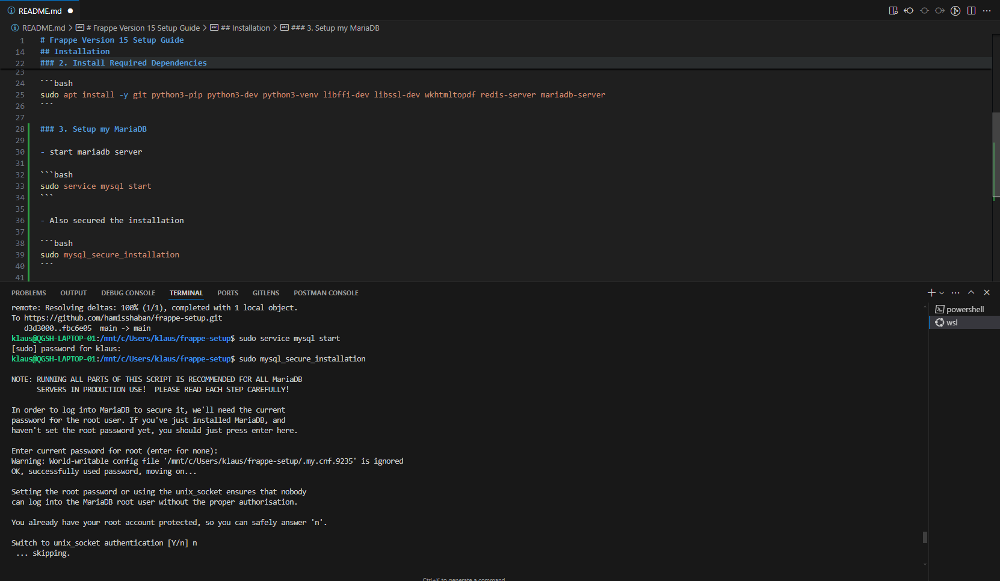

# Frappe Version 15 Setup Guide

This document provides a step-by-step guide to how i installed and configured Frappe Version 15. It also includes instructions on how to access and manage the installed modules.

## Table of Contents

- [Installation](#installation)
- [Configuration](#configuration)
- [Accessing and Managing Modules](#accessing-and-managing-modules)
- [Screenshots](#screenshots)

---

## Installation

### 1. Initially i updated my system

```bash
sudo apt update && sudo apt upgrade -y
```

### 2. Install Required Dependencies

```bash
sudo apt install -y git python3-pip python3-dev python3-venv libffi-dev libssl-dev wkhtmltopdf redis-server mariadb-server
```

### 3. Setup my MariaDB

- start mariadb server

```bash
sudo service mysql start
```

- Also secured the installation 

```bash
sudo mysql_secure_installation
```

- Created a database and a user using the following commands

```bash
mysql -u root -p
```

### 4. Installed bench
- This is to manage frappe application
```bash
sudo pip3 install frappe-bench
```
### 5. Creating frappe environment using bench

```bash
bench init --frappe-branch version-15 frappe-bench
```

- This created a frappe-bench directory in my home directory

- I navigated into the directory

```bash
cd frappe-bench
```

- I created a new site
```bash
bench new-site mysite.local
```

## Configuration and access instructions

- Accessing the frappe site was done via the browser on the address `http://localhost:8000`

- From the main dashboard i was able to access the installed modules i.e CRM, HR, etc.
  
- Since each module has its own settings, i was able to access the settings for each of the installed modules.
  
## Screenshot





